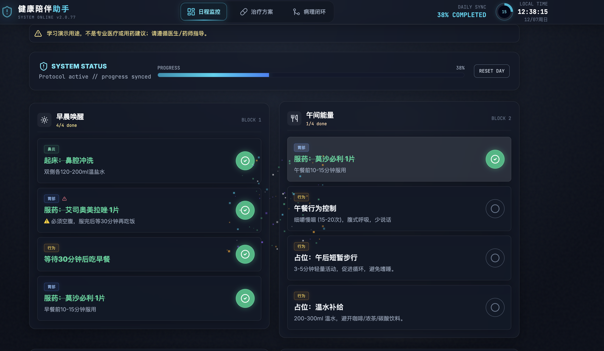
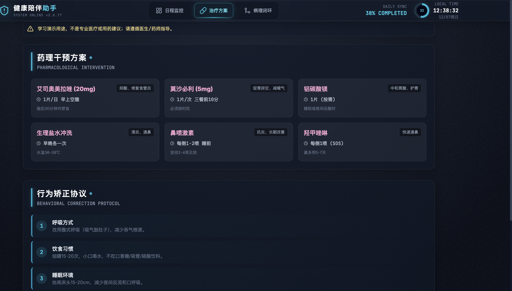
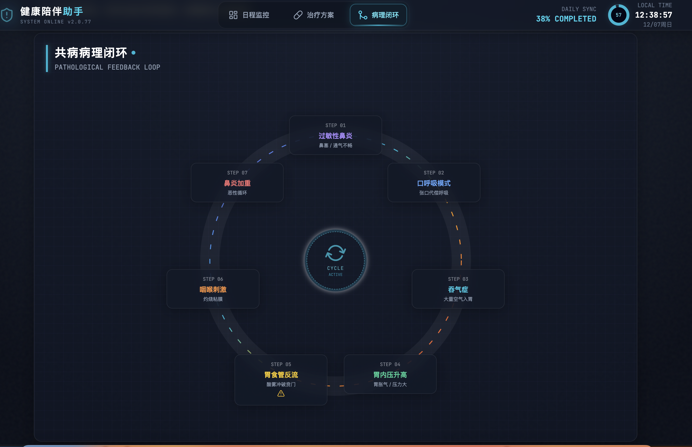

# CyberHealth / HealthMate

一个带霓虹赛博风的健康日程追踪器，包含任务进度、用药/行为计划、病理闭环可视化、实时时钟、创作者信息与社交链接。任务状态持久化到本地存储，支持 PC 与 H5 适配。

## 快速开始
- 安装依赖：`npm install`
- 启动开发：`npm run dev`（默认 http://localhost:5173）
- 打包：`npm run build`（输出目录 `dist/`）
- 预览构建：`npm run preview`

## 主要特性
- 赛博风单页界面：顶部导航 + 日程监控 / 治疗方案 / 病理闭环三大视图。
- 任务管理：点击圆形按钮或卡片可勾选，进度条带动画过渡；完成时触发粒子动画（confetti）。
- 数据驱动：日程、药物、行为内容集中在 `src/data/content.js`，保持单一数据源。
- 设备适配：调整了字体、间距和交互热点，兼容 H5，PC 体验不受影响。
- 实时信息：右上角时钟带秒环动画；底部创作者信息区，含 MediaCrawler 徽章与社交跳转。

## 项目结构
- `src/App.jsx`：主界面、Tab 切换、任务状态/进度条、实时钟表、创作者页脚、移动端底部导航。
- `src/data/content.js`：日程任务、用药信息、行为规则（中午任务已并入核心数据）。
- `src/index.css`：Tailwind 基础与全局样式；额外动画和主题色在 `App.jsx` 内联样式中。
- `tailwind.config.js`：JIT 配置，包含渐变/慢速旋转等 safelist。
- `public/logos/`：社交图标（GitHub / B 站 / 小红书 / 抖音 / 自定义头像）。

## 使用与开发提示
- React 18 + Vite 5 + Tailwind 3.4，ESLint Flat 配置在 `eslint.config.js`。
- 本地存储键：`healthMateTasks_v2`，可按需版本化以便迁移。
- `important` 任务带警示图标；完成状态和进度均可复位（RESET DAY 按钮）。
- H5 适配：减少边距、优化字体和按钮尺寸；底部留出空间避开移动端导航。

## 截图预览

## 贡献说明
- 建议使用 Conventional Commits（如 `feat:` / `fix:` / `chore:`）。
- 提交 PR 前至少执行 `npm run build`；如扩展代码库可补充 lint/测试。
- 数据变更优先在 `src/data/content.js` 维护，UI 行为通过组件层调整。
